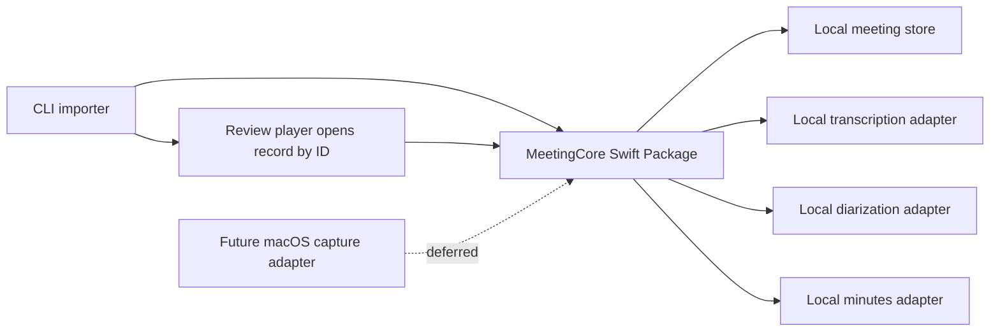

# Architecture — Meeting Summarizer

Status: Accepted

This is the Sprint 1 candidate architecture. Sprint 2 has revised the SRS
with separate transcription, optional speaker recognition, optional summary,
and low-quality-audio use cases. The shared core and local-adapter direction
remain accepted. The single-import flow below is the original baseline;
its replacement is under managed-mode design review, as recorded in the
[Sprint 2 change proposal](../progress/sprint_2/sprint_2_proposedchanges.md).

## Decision

Use Swift on macOS, with a SwiftUI review application, a shared Swift Package
core, a command-line executable, Swift Testing, local-only storage, and replaceable
local-model adapters. This is a candidate architecture, not a claim that the
selected local AI models have already passed feasibility validation.

Swift Package Manager provides package and test targets; SwiftUI
is designed for Apple-platform user interfaces. The architecture therefore
keeps reusable domain behavior in the package and restricts macOS UI/capture
integration to adapters. See [Swift Package documentation](https://docs.swift.org/package-manager/PackageDescription/PackageDescription.html)
and [SwiftUI documentation](https://developer.apple.com/documentation/technologyoverviews/swiftui).

## Component boundaries

`MeetingCore` owns the meeting record, timeline references, attribution
corrections, use cases, validation, and protocol contracts. It must not import
SwiftUI or AppKit or call a network service.

`MeetingCLI` parses arguments, invokes core use cases, and reports local
results or errors. It must not own a separate record format or processing
logic. The current prototype exposes `import`; the proposed revision exposes
`transcribe`, `recognize`, and `summarize` independently.

`MeetingMacApp` is the SwiftUI local-media review player and chair correction
workflow. It must not contain core transcription or minutes logic.

Local-model adapters invoke the selected on-device transcription,
diarization, or minutes implementation. They must not expose a remote
fallback. The local meeting store atomically persists source references and
derived data; it must not synchronize to a cloud service.

## Domain contract

A `MeetingRecord` has an immutable local source reference, ordered transcript
segments, neutral or chair-assigned speaker identities, minutes, decisions,
actions, and open questions. A `SourceRange` optionally connects a review item
to time offsets in the local recording; participant-facing minutes do not
require or display it. Corrections are additive record changes so a speaker
label or segment attribution can be reviewed without rewriting unrelated data.

The CLI calls the same import use case used by the review player. It writes
through the local store and prints an opaque local record identifier. The
operator opens that identifier in the review player, which reloads the record
from the store and seeks local media when the operator selects a source range.
This avoids duplicate business logic, a running background app, and a separate
IPC payload.

## Sprint 2 change under review

The requested CLI will split the baseline import flow into a transcript-only
operation, optional speaker-turn recognition and chair edits, and optional
minutes generation. A summary may use neutral labels if the recognition step
is skipped. These operations should update the same local meeting record and
retain model provenance. Their exact commands, persistence behavior, and
tests are in the Sprint 2 proposal until its design revision is accepted.

The revised SRS also requires warnings for audio that may undermine
transcription or attribution. The architecture must allow warnings to refer
to a neutral speaker ID when supported by evidence, or to a source range
alone when speaker attribution is uncertain. It must preserve the original
recording and prior local result for comparison with any alternate input.
Sprint 2 PBI-018 tests this risk on an approved AMI meeting; the benchmark
does not yet establish a production detection threshold or recovery policy.

## Platform and portability

The macOS app owns SwiftUI presentation and any later operating-system
permission flow. A future capture adapter can use ScreenCaptureKit, which
supports selecting and streaming screen content and requires user permission;
it is intentionally deferred from the first release. See [Apple's
ScreenCaptureKit documentation](https://developer.apple.com/documentation/screencapturekit).

iOS portability is preserved by keeping `MeetingCore`, record schema, local
model contracts, and store semantics free of macOS-only imports. iOS would add
its own UI and permitted-input adapters rather than reuse the macOS capture UI.

## Risks deliberately deferred to prototype validation

- Which local transcription, diarization, and language-model implementations
  meet quality, license, packaging, memory, and latency needs.
- Exact input-media codecs and whether any conversion is needed.
- Local storage encryption and lifecycle policy.
- The future live-capture consent/permission path.
