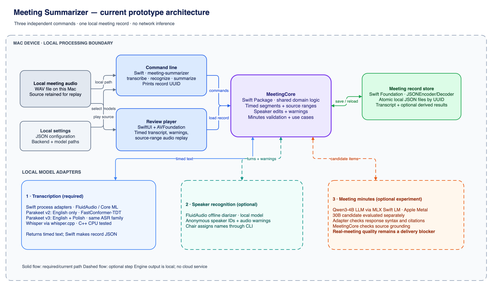

# Architecture — Meeting Summarizer

Status: Accepted

This is the Sprint 1 candidate architecture, refined by the accepted Sprint 2
design amendment. The separate transcription, optional speaker recognition,
optional summary, and low-quality-audio use cases keep the shared core and
local-adapter direction.

## Decision

Use Swift on macOS, with a SwiftUI review application, a shared Swift Package
core, a command-line executable, Swift Testing, local-only storage, and replaceable
local-model adapters. This is a candidate architecture, not a claim that the
selected local AI models have already passed feasibility validation.

Swift Package Manager provides package and test targets; SwiftUI
is designed for Apple-platform user interfaces. The architecture therefore
keeps reusable domain behavior in the package and restricts macOS UI/capture
integration to adapters. See [Swift Package documentation](https://docs.swift.org/package-manager/PackageDescription/PackageDescription.html)
and [SwiftUI documentation](https://developer.apple.com/documentation/technologyoverviews/swiftui).

## Component boundaries

The [editable draw.io diagram](architecture_overview.drawio) shows the
current macOS prototype and the technology behind each implemented path.
Dashed branches are optional operations; the minutes branch is an
experiment whose real-meeting quality still blocks delivery.

Parakeet is a specialized speech-recognition model, not the minutes LLM.
NVIDIA identifies [v2](https://huggingface.co/nvidia/parakeet-tdt-0.6b-v2)
as English-only and [v3](https://huggingface.co/nvidia/parakeet-tdt-0.6b-v3)
as multilingual, including English and Polish. Both are FastConformer–TDT
ASR models. Qwen is the separate local language-model experiment for
optional draft minutes.
NVIDIA also lists a [1.1B multilingual RNNT model](https://build.nvidia.com/nvidia/parakeet-1_1b-rnnt-multilingual-asr)
with Polish among its supported languages. That model is not integrated
or benchmarked in this prototype, so it does not appear as an active
diagram component.

`MeetingCore` owns the meeting record, timeline references, attribution
corrections, use cases, validation, and protocol contracts. It must not import
SwiftUI or AppKit or call a network service.

`MeetingCLI` parses arguments, invokes core use cases, and reports local
results or errors. It must not own a separate record format or processing
logic. The prototype exposes `transcribe`, `recognize`, and `summarize`
independently; `import` remains as a compatibility command for early tests.

`MeetingMacApp` is the SwiftUI local-media review player and chair correction
workflow. It must not contain core transcription or minutes logic.

Local-model adapters invoke the selected on-device transcription,
diarization, or minutes implementation. They must not expose a remote
fallback. The local meeting store atomically persists source references and
derived data; it must not synchronize to a cloud service.

Transcription is an ordered sequence of timed text segments from the selected
ASR engine. The adapter reads the engine's output, validates times and text,
and creates `TranscriptSegment` values; MeetingCore serializes the meeting
record to JSON for local storage. Engine JSON output, where used, is an
adapter transport detail. ASR does not receive a free-text prompt asking
it to produce the record schema or meeting minutes. Minutes generation is
a separate, optional operation on the saved transcript.

The Sprint 2 minutes failure added an explicit **model-response gate** to
this boundary. An adapter validates response syntax, schema, size, and
references before handing a candidate to core. Core then validates source
grounding and domain meaning before a derived item can enter the local
record or feed another step. A bounded technical repair request may be
sent back to the model; final failure preserves the prior record. The
prototype currently implements this gate for minutes. NFR-06 requires
future model-backed adapters to provide an equivalent validated boundary,
with checks suited to their output contract. The gate cannot establish
audio or transcription truth on its own; chair review remains part of the
workflow.

The Product Owner accepted a [multi-stage minutes repair
design](../progress/sprint_2/sprint_2_design.md#approved-multi-stage-minutes-repair-design--2026-10-03)
after the one-call evidence-first adapter failed real-meeting quality
checks. It adds an immutable-source transcription correction layer, topic
assignment with complete coverage of substantive utterances, per-topic
summaries, and separate extraction of decisions and tasks. This is the
accepted design and is now an executable Sprint 2 experiment. The CLI
defaults to the staged path while `--pipeline legacy` retains the one-call
comparison. The [editable architecture diagram](architecture_overview.drawio)
has a second page for cleanup, model-response gates, source checks, and
operator review. On the same saved AMI and Sejm transcripts, the staged
run achieved complete structural utterance coverage but only 2/5 and
2/4 source-supported topic summaries under the documented manual audit.
The [trial report](../progress/sprint_2/tests/multistage_minutes_trial_20261004.md)
records the evidence and keeps the one-call failure visible. Source ID
validity alone is insufficient to prove that a summary is true.

## Domain contract

A `MeetingRecord` has an immutable local source reference, ordered transcript
segments, neutral or chair-assigned speaker identities, minutes, decisions,
actions, and open questions. A `SourceRange` optionally connects a review item
to time offsets in the local recording; participant-facing minutes do not
require or display it. Corrections are additive record changes so a speaker
label or segment attribution can be reviewed without rewriting unrelated data.

The CLI calls core transcription, recognition, and summarization use cases.
It writes through the local store and prints an opaque local record identifier. The
operator opens that identifier in the review player, which reloads the record
from the store and seeks local media when the operator selects a source range.
This avoids duplicate business logic, a running background app, and a separate
IPC payload.

## Sprint 2 accepted CLI refinement

The CLI splits the baseline import flow into a transcript-only operation,
optional speaker-turn recognition and chair edits, and optional minutes
generation. A summary may use neutral labels if the recognition step is
skipped. These operations update the same local meeting record and retain
model provenance. The accepted commands and their evidence are in the
[Sprint 2 implementation record](../progress/sprint_2/sprint_2_implementation.md).

The revised SRS also requires warnings for audio that may undermine
transcription or attribution. The architecture must allow warnings to refer
to a neutral speaker ID when supported by evidence, or to a source range
alone when speaker attribution is uncertain. It must preserve the original
recording and prior local result for comparison with any alternate input.
Sprint 2 PBI-018 tests this risk on an approved AMI meeting; the benchmark
does not yet establish a production detection threshold or recovery policy.

The accepted FR-11 prototype amendment adds an explicit transcription language
request (`en`, `pl`, or `auto`) at the CLI boundary. MeetingCore persists that
request separately from the ASR backend and selected model revision. The
process adapters reject known English-only weights for Polish and automatic
selection. Parakeet v3 and multilingual Whisper are local candidates; a
requested or automatically selected language does not by itself prove correct
speech recognition. Sprint 2 compares both candidates on referenced speech,
while mixed-language policy and production thresholds remain open.

## Platform and portability

The macOS app owns SwiftUI presentation and any later operating-system
permission flow. A future capture adapter can use ScreenCaptureKit, which
supports selecting and streaming screen content and requires user permission;
it is intentionally deferred from the first release. See [Apple's
ScreenCaptureKit documentation](https://developer.apple.com/documentation/screencapturekit).

iOS portability is preserved by keeping `MeetingCore`, record schema, local
model contracts, and store semantics free of macOS-only imports. iOS would add
its own UI and permitted-input adapters rather than reuse the macOS capture UI.

## Risks deliberately deferred to prototype validation

- Which local transcription, diarization, and language-model implementations
  meet quality, license, packaging, memory, and latency needs.
- Exact input-media codecs and whether any conversion is needed.
- Local storage encryption and lifecycle policy.
- The future live-capture consent/permission path.

## Reading pipeline correction — 4 October 2026

Meeting Review maps selected transcript phrases through `TranscriptSelection` to source IDs, UTF-16 anchors and source audio. Optional range events preserve raw ASR and supersede earlier active events when selection crosses a replacement; unselected words remain. CLI single-source edits and GUI range edits share the store and core validators. A text/profile revision rejects stale selections before save. Inspection, the GUI and multi-stage minutes share the corrected projection. The store reloads the saved record before applying the validated correction and writes atomically; raw ASR remains immutable, correction history is appended and dependent minutes are invalidated. The SwiftUI reading state refreshes after an in-app save. This is a single-writer prototype: the operation has no cross-process transaction lock, and external CLI changes require reopening the view. The [operator manual](../progress/sprint_2/user_manual.md#correct-words-inside-meeting-review) explains the approved workflow.

Parakeet/Whisper ASR produces timed text. FluidAudio `OfflineDiarizerManager` separately analyzes audio to produce anonymous voice turns; Swift assigns ASR-part labels by greatest positive temporal overlap. Swift `TranscriptCleaner` then groups those parts using a saved `TranscriptCleanupPolicy`. The LLM enters later, for topic assignment, per-topic summaries and explicit minutes items. Operator review can occur before generation or return to the source after it.

The [Sprint 2 segmentation contract](../progress/sprint_2/transcript_segmentation.md) exposes all eleven reading-layer controls. By default, explicit speaker changes create boundaries and same-speaker parts join until a gap reaches the configurable `longSilenceBoundarySeconds` (10 s by default). The same label can therefore appear in separate paragraphs; no default duration cap applies. CLI inspection, the SwiftUI review app and multi-stage minutes use the same saved policy. Changed profiles invalidate dependent results while preserving original text, names and corrections. This correction removes the arbitrary 15-second reading cut and the separate 1.5-second reading gap cutoff; a 1.5-second neighbor-proposal threshold remains independently configurable. Semantic boundary validation and independent voice reassessment remain unimplemented. Speaker clusters can still merge people incorrectly. The [current presentation](../progress/sprint_2/sprint_2_increment_demo.pptx) separates these responsibilities explicitly.

The review player exposes one media-clock position and a full-recording slider in both review and correction views. Scrubbing cancels bounded playback, pauses and seeks; explicit Play resumes. This temporal aid does not establish semantic topic boundaries. Current evidence: [long-silence repair](../progress/sprint_2/tests/long_silence_review_20261004.json).

## Transcript/audio synchronization — accepted Sprint 2 refinement

The ephemeral Swift `TranscriptAudioIndex` reuses `RangeProjection`, the saved reading profile and immutable source intervals. It maps UTF-16 display spans to source IDs and times and rebuilds only when the record changes. Forward lookup retains overlapping hits and uses start-inclusive/end-exclusive source intervals; even inside a corrected range, an untimed gap yields no highlight. Reverse lookup validates character boundaries and resolves the earliest intersecting source start, so repeated wording does not cause a text-search guess. Saved corrections remain one span at their source precision.

`ReviewPlayback` owns the AVPlayer clock, transient slider position and cancellable seeks. SwiftUI displays that position in both sliders. Genuine text selection pauses and seeks; explicit Play during a pending seek waits for its completion. AppKit applies temporary layout background attributes to timed text without changing native `selectedRanges`. SwiftUI follows the active reading card and AppKit follows the active text range. This processing uses Swift/AppKit/AVFoundation, not an ASR or LLM call. The [operator instructions](../progress/sprint_2/user_manual.md#synchronize-audio-and-transcript-text) separate implemented behavior from pending native listening and scrolling checks.
