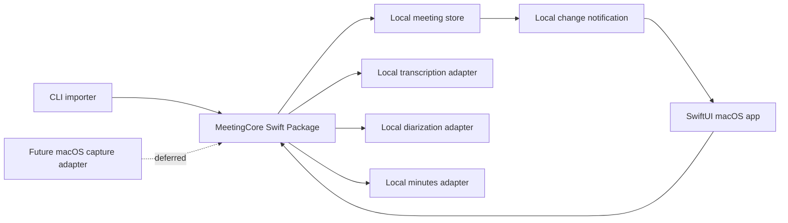

# Candidate architecture — Meeting Summarizer

Status: Proposed

## Decision

Use Swift on macOS, with a SwiftUI review application, a shared Swift Package
core, a command-line executable, XCTest, local-only storage, and replaceable
local-model adapters. This is a candidate architecture, not a claim that the
selected local AI models have already passed feasibility validation.

Swift Package Manager provides package targets and XCTest test targets; SwiftUI
is designed for Apple-platform user interfaces. The architecture therefore
keeps reusable domain behavior in the package and restricts macOS UI/capture
integration to adapters. See [Swift Package documentation](https://docs.swift.org/package-manager/PackageDescription/PackageDescription.html)
and [SwiftUI documentation](https://developer.apple.com/documentation/technologyoverviews/swiftui).

## Component boundaries

| Component | Responsibility | Must not do |
|---|---|---|
| `MeetingCore` | Meeting record, timeline references, attribution corrections, use cases, validation, and protocol contracts | Import SwiftUI/AppKit or call a network service |
| `MeetingCLI` | Parse input arguments, invoke import, report local result/error | Own a separate record format or processing logic |
| `MeetingMacApp` | SwiftUI review, chair correction workflow, local refresh subscription | Contain core transcription or minutes logic |
| Local-model adapters | Invoke a selected on-device transcription, diarization, or minutes implementation | Expose remote fallback behavior |
| Local meeting store | Atomically persist source references and derived data within the app-controlled local location | Synchronize to a cloud service |
| Local change notifier | Tell the running UI that a record changed | Carry meeting contents outside the device |

## Domain contract

A `MeetingRecord` has an immutable local source reference, ordered transcript
segments, neutral or chair-assigned speaker identities, source-linked minutes,
decisions, actions, and open questions. A `SourceRange` contains time offsets
into the local recording. Corrections are additive record changes so a speaker
label or segment attribution can be reviewed without rewriting unrelated data.

The CLI calls the same import use case used by the UI. It writes through the
local store and emits only an opaque local record identifier over the local
change boundary. The UI then reloads the record from the same store. This
avoids duplicate business logic and avoids passing meeting content through a
separate IPC payload.

## Platform and portability

The macOS app owns SwiftUI presentation and any later operating-system
permission flow. A future capture adapter can use ScreenCaptureKit, which
supports selecting and streaming screen content and requires user permission;
it is intentionally deferred from the first release. See [Apple's
ScreenCaptureKit documentation](https://developer.apple.com/documentation/screencapturekit).

iOS portability is preserved by keeping `MeetingCore`, record schema, local
model contracts, and store semantics free of macOS-only imports. iOS would add
its own UI and permitted-input adapters rather than reuse the macOS capture UI.

## Risks deliberately deferred to prototype validation

- Which local transcription, diarization, and language-model implementations
  meet quality, license, packaging, memory, and latency needs.
- Exact input-media codecs and whether any conversion is needed.
- Local storage encryption and lifecycle policy.
- The lowest-risk local notification mechanism for a UI started before or after
  a CLI import.
- The future live-capture consent/permission path.
